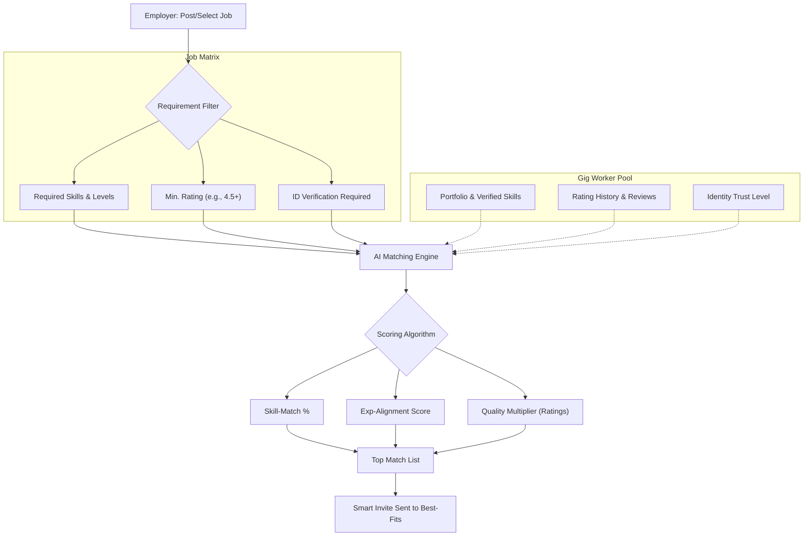
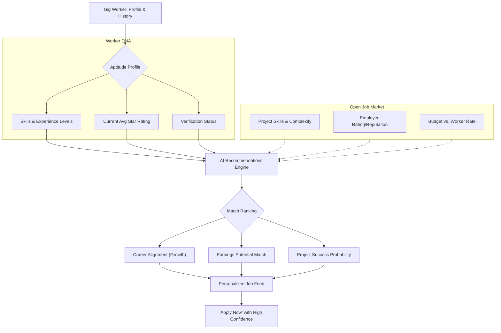

# Optimization of Server Polling and Performance

The goal is to reduce the server load and log noise caused by frequent, heavy polling from the frontend. We will consolidate the notification and message unread counts into a single "heartbeat" endpoint and update the frontend accordingly.

## Proposed Changes

### Backend: Heartbeat Endpoint

#### [NEW] [UserHeartbeatController.php](file:///c:/Users/Administrator/Desktop/WorkWise4/New%20folder/WorkWise/app/Http/Controllers/UserHeartbeatController.php)
Create a new controller with a [heartbeat](file:///c:/Users/Administrator/Desktop/WorkWise4/New%20folder/WorkWise/app/Http/Controllers/UserHeartbeatController.php#19-42) method that returns:
- `unread_notifications_count`
- `unread_messages_count`

#### [MODIFY] [web.php](file:///c:/Users/Administrator/Desktop/WorkWise4/New%20folder/WorkWise/routes/web.php)
Register the new route: `GET /api/user/heartbeat`.

### Frontend: Authenticated Layout

#### [MODIFY] [AuthenticatedLayout.jsx](file:///c:/Users/Administrator/Desktop/WorkWise4/New%20folder/WorkWise/resources/js/Layouts/AuthenticatedLayout.jsx)
- Replace `checkForNewNotifications` and `checkForNewMessages` with a single [pollHeartbeat](file:///c:/Users/Administrator/Desktop/WorkWise4/New%20folder/WorkWise/resources/js/Layouts/AuthenticatedLayout.jsx#440-484) function.
- Update the component to only fetch full notification/message lists when the count actually increases or when the dropdown is opened.
- Increase the polling interval slightly (e.g., from 15s to 20s or 30s) to further reduce load.

## Verification Plan

### Automated Tests
- Create a feature test to verify the `/api/user/heartbeat` endpoint returns correct counts.
- Run `php artisan test --filter=HeartbeatTest`

### Manual Verification
- Observe the `php artisan serve` logs to ensure the frequency of requests has decreased.
- Verify that notification and message badges still update correctly when new items arrive.
- Check that the page remains responsive and static assets (like the logo) load quickly.

---

# Optimization: Job Creation for AI Matching

The goal is to streamline the job creation form to remove redundancies and add specific preferences (ratings and verification) to serve as a high-quality basis for AI matching.

## Proposed Changes

### 1. Database & Model

#### [NEW] [Migration: add_matching_criteria_to_gig_jobs_table](file:///c:/Users/Administrator/Desktop/WorkWise4/New%20folder/WorkWise/database/migrations/2026_02_26_matching_criteria.php)
- Add `min_rating` (decimal, nullable) to `gig_jobs`.
- Add `verified_only` (boolean, default: false) to `gig_jobs`.

#### [MODIFY] [GigJob.php](file:///c:/Users/Administrator/Desktop/WorkWise4/New%20folder/WorkWise/app/Models/GigJob.php)
- Add `min_rating` and `verified_only` to `$fillable`.

#### [MODIFY] [GigJobController.php](file:///c:/Users/Administrator/Desktop/WorkWise4/New%20folder/WorkWise/app/Http/Controllers/GigJobController.php)
- Update [store](file:///c:/Users/Administrator/Desktop/WorkWise4/New%20folder/WorkWise/app/Http/Controllers/BidController.php#56-96) and [update](file:///c:/Users/Administrator/Desktop/WorkWise4/New%20folder/WorkWise/app/Http/Controllers/BidController.php#124-291) validation rules to include new fields.

### 2. Frontend UI/UX Redesign

#### [MODIFY] [Create.jsx](file:///c:/Users/Administrator/Desktop/WorkWise4/New%20folder/WorkWise/resources/js/Pages/Jobs/Create.jsx) & [Edit.jsx](file:///c:/Users/Administrator/Desktop/WorkWise4/New%20folder/WorkWise/resources/js/Pages/Jobs/Edit.jsx)
- **Consolidate Skills**: Merge "AI-Suggested" and "Emerging Skills" into a single "Recommended Skills" row within or directly above the `SkillExperienceSelector`.
- **Remove Redundancy**: Combine "Job Complexity" and "Experience Level" into a single smart selector.
- **Add Worker Preferences**: 
  - Add a "Worker Requirements" section.
  - Implement a "Minimum Rating" selector (e.g., 4.0+, 4.5+ stars).
  - Implement a "Verified Only" toggle.

## Verification Plan

### Automated Tests
- Update `GigJobTest.php` to verify new fields are saved correctly.
- Verify `php artisan route:list` is unchanged.

### Manual Verification
- Test that selecting "Add All" from suggestions correctly populates the consolidated skills table.
- Verify that the new "Worker Requirements" section appears correctly on both Create and Edit pages.

## AI Matching Flow Visualization

Below are the conceptual flows for both user types, showing how the AI Matching Engine creates a high-quality bridge between demand and talent.

### 1. Employer Flow: Finding the Best Talent
Focuses on locating top-tier workers who meet strict project requirements.

### 2. Gig Worker Flow: Finding the Best Jobs
Focuses on matching the worker's career profile to the most relevant opportunities.

